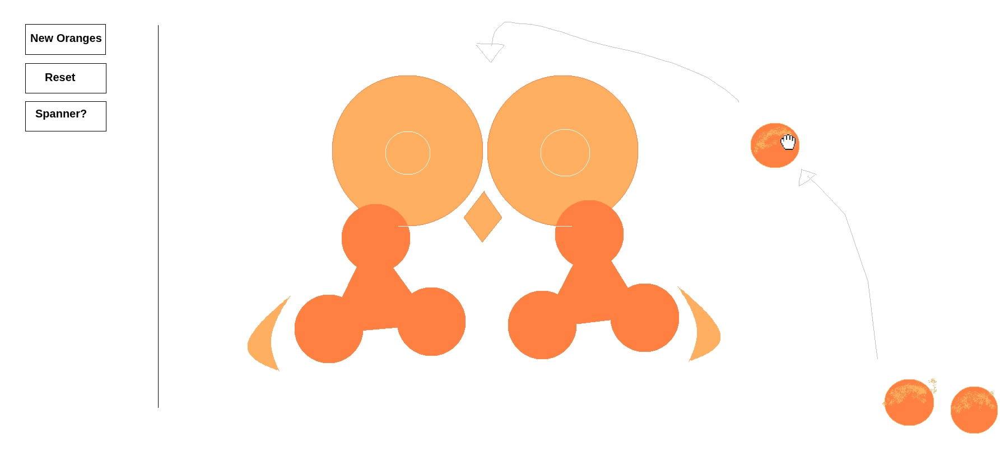

# Juicer

This was the plan I concocted in jspaint. 

The idea was to recreate the juicer in 

**Note:** MacOS has not been tested.

### Dependencies

### Linux

#### Ubuntu / Debian / Mint

    sudo apt install libsdl2-dev libsdl2-image-dev libsdl2-mixer-dev libsdl2-ttf-dev

#### CentOS / Fedora

    sudo yum install SDL2-devel SDL2_image-devel SDL2_mixer-devel SDL2_ttf-devel

#### openSUSE

    sudo zypper install libSDL2-devel libSDL2_image-devel libSDL2_mixer-devel libSDL2_ttf-devel

#### Arch / Manjaro

    sudo pacman -S sdl2 sdl2_image sdl2_mixer sdl2_ttf

### Ruby Gem

Install the Ruby2D gem:

    `gem install ruby2d`

Running the App
---------------

Simply run:

    `ruby juice.rb`

